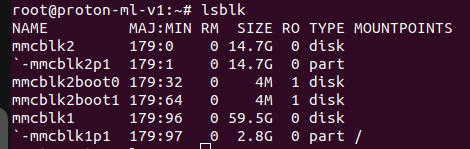
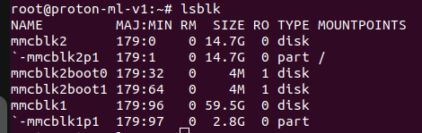

Primero bootea la sd card con la imagen. Luego si se necesita, cambia las particiones de la imagen
```bash
zstdcat proton_ml_BASE-SD-v1_1-vSYMPHONY.img.zst | sudo dd of=/dev/sda bs=4M && sync
```

# To change partitions:

Umount the disk (sudo umount /media/...)

```bash
sudo umount /media/maria/root
```


```bash
sudo fdisk /dev/sdX (the node where the SD is)
```

```bash
sudo fdisk /dev/sda
```

Next, run the following sequence of commands followed by enter with each step explained with a "-" to the right. Each command/input should be followed by enter:

- Select option `p`
- `d` - Delete current partition (1).
- `n` - Create a new partition.
- Empty, hit enter only which will leave default response p for primary partition.
- Empty, hit enter only which will leave default response 1 for first partition.
- `16384` - Enter 16384 to begin partition past bootloader section.
- Empty, hit enter only which will leave last sector as default which should choose ending size of the SD card.
- `N` - Answers no to not remove the ext4 signature on the disk
- `p` - Print output and verify before we write. We should see the starting offset the same and the end expanded to fill the SD card.
- `w` - Write output to disk

Now expand the file system:

```bash
sudo e2fsck -f /dev/mmcblk0p1
sudo resize2fs /dev/mmcblk0p1
sync
```

```bash
sudo e2fsck -f /dev/sda1
sudo resize2fs /dev/sda1
sync
```

# Enviar a emmc

si al ejecutar `lsblk`, tenemos que el `/` está en `mmcblk1p1` entonces estamos en la sd.



```bash
cd /usr/bin/
```

Ejecutar
```bash
./install_debian.sh
```

reinicia 

si al ejecutar `lsblk`, tenemos que el `/` está en `mmcblk2p1` entonces estamos en la memoria interna.



# Wifi
[wifi](https://variwiki.com/index.php?title=Wifi_SystemdNetworkd&release=mx8mp-debian-bookworm-6.6.52_24.12-v1.0)


The SOM can be configured either for using one of two Wi-Fi modules based on NXP chipset:
• 2.4GHz & 5GHz Wi-Fi® + Bluetooth® + 802.15.4 Module based on NXP IW612 chipset
• 2.4GHz & 5GHz Wi-Fi® + Bluetooth® Module based on NXP IW611 chipset